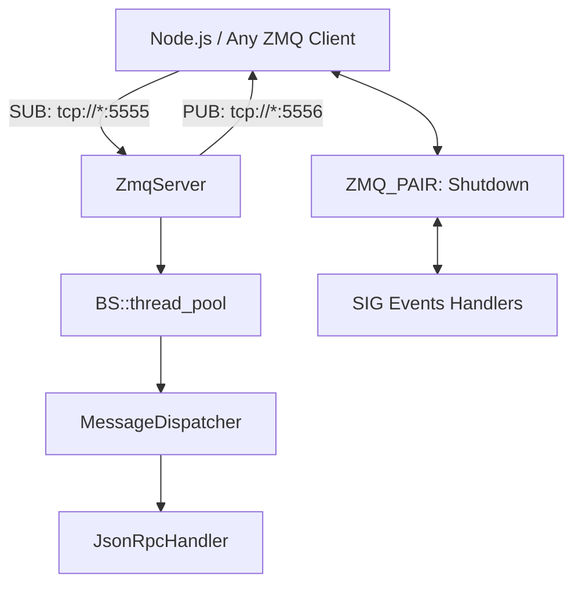

# ZeroMQ JSONRPC Task Server

A high-performance C++23 application that processes JSONRPC requests over ZeroMQ's PUB/SUB pattern, designed to run in a Docker container. The server listens for RPC commands from ZeroMQ compatible PUB clients (can be written in any language), distributes work to a thread pool, and publishes responses, errors, and logs back to the client. It targets minimal end-to-end latency and tries to follow SOLID principles for maintainability and extensibility.

With this you can build asynchronous task distribution systems, such as streaming media processing applications.

This server uses a modular C++23 architecture with a ZeroMQ SUB socket to receive JSONRPC requests (e.g., launchPipeline) from any ZeroMQ client (e.g. Node.js client) and a ZeroMQ PUB socket to send back responses, errors, and logs, all asynchronously. Requests are parsed with `simdjson` and dispatched via a `std::unordered_map` to a `BS::thread_pool` for processing, ensuring optimal latency. Logs are sent as JSONRPC notifications over the PUB socket. The server uses `zmq::poll()` efficiently by waiting for both the SUB socket and a ZMQ_PAIR sockets for shutdown signals, enabling efficient, indefinite blocking (thus no CPU cycles get wasted for frequent timeouts). 



## Features

- **ZeroMQ PUB/SUB**: SUB socket receives JSONRPC requests; PUB socket sends responses, errors, and logs.
- **High-Performance Worker Pool**: Uses `BS::thread_pool` with worker count based on hardware concurrency.
- **JSONRPC Processing**: Parses requests with `simdjson` and dispatches methods (`launchPipeline`, `stopPipeline`) via a compile-time `std::unordered_map` for O(1) lookup.
- **Performance Optimizations**:
  - Zero-copy JSON parsing with `simdjson`.
  - Lock-free task submission via `BS::thread_pool`.
  - Minimal allocations using `std::string_view`.
  - CMake based compilation with Docker ready builds
- **Error Handling**:
  - Exponential backoff retries (1ms, 2ms, 4ms) for failed operations.
  - Worker crash handling with exception logging.
  - Graceful shutdown on SIGINT/SIGTERM using ZMQ_PAIR `inproc` socket for efficient polling.
- **Logging**: Sends logs as JSONRPC notifications over PUB socket.
- **Benchmarking**: Integrates Tracy for profiling latency and throughput, enabled via `--benchmark` flag.
- **Dockerized**: Runs on `ubuntu:24.04` with multi-stage build for minimal image size.

## Prerequisites

- Docker (for building and running the container).
- Node.js client with ZeroMQ support (binds SUB socket at `tcp://*:5555`, connects to PUB socket at `tcp://<container>:5556`).
- Tracy client (optional, for profiling when `--benchmark` is enabled).

## Setup

1. **Clone the Repository**:
   ```bash
   git clone https://github.com/KrishnaPG/zeromq-task-dispatcher zmq-task-dispatcher
   cd zmq-task-dispatcher
   ```

2. **Build the Docker Image**:
   ```bash
   docker build -t zmq-task-dispatcher .
   ```

3. **Run the Container**:
   ```bash
   docker run -p 5556:5556 -e PUB_ENDPOINT=tcp://*:5556 -e SUB_ENDPOINT=tcp://host.docker.internal:5555 zmq-task-dispatcher
   ```
   - Replace `host.docker.internal` with the host IP if needed.

4. **Node.js Client**:
   - Ensure the client sends JSONRPC requests (e.g., `launchPipeline`) to `tcp://<container>:5555` and subscribes to `tcp://<container>:5556` for responses, errors, and logs.
   - Example request:
     ```javascript
     await client.sendRequest('launchPipeline', {
       method: 'launch',
       params: {
         pipeline: `rtspsrc location=rtsp://camera2 ! rtph264depay ! h264parse ! mp4mux ! appsink name=output`,
         transport: "zeromq",
         streamId: "cam2"
       }
     });
     ```

5. **Profiling with Tracy**:
   - Install the Tracy client from [https://github.com/wolfpld/tracy](https://github.com/wolfpld/tracy).
   - Connect to the container’s Tracy server (port 8086) to visualize performance data.
   - Latency metrics are logged via PUB socket when `--benchmark` is enabled.

## Extending the Application

To add new JSONRPC methods (e.g., `newMethod`):

1. **Update `message_dispatcher.cpp`**:
   Add a new entry to the `handlers_` map:
   ```cpp
   {"newMethod", [](simdjson::ondemand::document& request, JsonRpcHandler& handler) {
       auto params = request["params"];
       handler.handle_new_method(params);
   }}
   ```

2. **Update `jsonrpc_handler.hpp/cpp`**:
   Declare and implement the new handler:
   ```cpp
   // jsonrpc_handler.hpp
   void handle_new_method(simdjson::ondemand::value& params);

   // jsonrpc_handler.cpp
   void JsonRpcHandler::handle_new_method(simdjson::ondemand::value& params) {
       int64_t id;
       if (params["id"].get_int64().get(id)) {
           send_error(id, -32602, "Missing ID");
           return;
       }
       // Implement logic
       send_response(id, json{{"status", "success"}}.dump());
   }
   ```

3. **Rebuild and Run**:
   ```bash
   docker build -t zmq-task-dispatcher .
   docker run -p 5556:5556 -e PUB_ENDPOINT=tcp://*:5556 -e SUB_ENDPOINT=tcp://host.docker.internal:5555 zmq-task-dispatcher
   ```

## Run without Docker

To build and run without docker, the following commands can be used from the source code root folder :
```sh   
   mkdir build
   cd build
   cmake ..
   make   
```

## Performance Notes

- **Latency**: Optimized for end-to-end latency using `simdjson`, `std::unordered_map`, and `BS::thread_pool`.
- **Throughput**: Scales with CPU cores, handling thousands of requests per second.
- **Idle Efficiency**: Uses ZMQ PAIR socket with `zmq_poll` to block indefinitely, waking only for messages or shutdown.
- **Profiling**: Tracy provides detailed metrics on message processing and task execution.

## Error Handling

- **Retries**: Exponential backoff (1ms, 2ms, 4ms) for failed operations, implemented in `utils::retry`.
- **Worker Crashes**: Exceptions are caught and logged, ensuring system stability.
- **Shutdown**: Graceful shutdown drains the thread pool and closes sockets on SIGINT/SIGTERM.

## Dependencies

- `libzmq`/`cppzmq`: ZeroMQ messaging.
- `simdjson`: High-performance JSON parsing.
- `BS::thread_pool`: Efficient thread pool.
- `Tracy`: Performance profiling (optional, enabled with `--benchmark`).
- `nlohmann/json`: JSON serialization for responses.

## License

MIT License (see `LICENSE` file, if included).

## Contact

For issues or contributions, please open a pull request or issue on the repository.